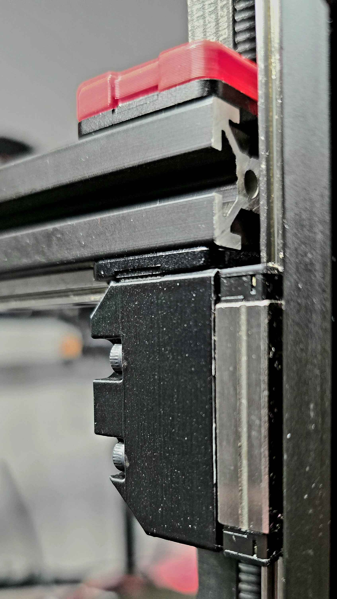

## Fixed 2.4 Z Joints


New Z joints for a Voron 2.4.  This replaces the belt clip, z bearing block and z joint.  These joints do not include any moving parts and so the gantry relies on the flexing of the various components to accomplish the quad gantry level.  This new joint creates a more rigid connection between the gantry and Z linear rails.  This increased rigidity can improve performance and has the added benefit of reducing the amount of gantry sag during motor power down.

```
BOM:
4  M5x40
4  M3x20
```

Confirmed compatible with Chaotic Labs Tool-less Front Tensioner but some washers may be required to avoid bottoming out the screws. 
Thanks to rikersb3ard on discord for photo and confirming fastener sizes.



