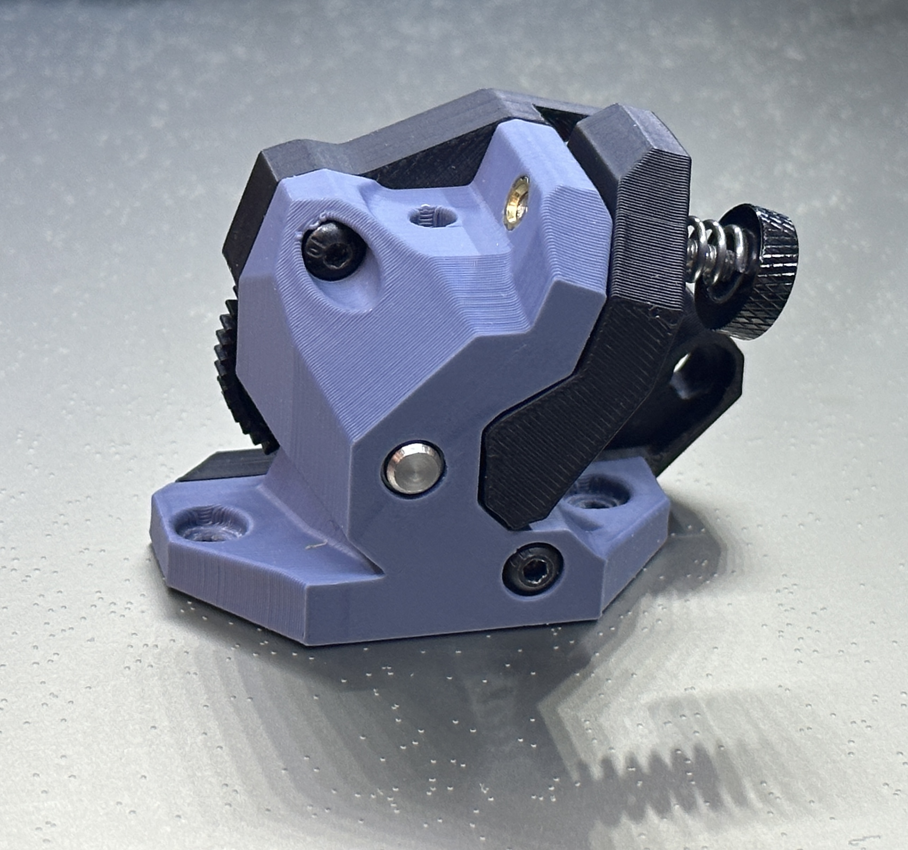

# Wristwatch BMG



A small form factor extruder using BMG gears and Orbiter 2 Mounting hole locations.
Developed by Voron Contributors

Extruder is made up of 3 parts:  Main Body, Motor Plate and Tension Arm.  The tension arm has an integrated support that is requried for 3D printing.

Additonal files:

1. Main Body with sherpa hole spacing for easy installation on existing toolheads using Sherpa spacing.
2. Rear Plate with Tail:  Additonal mounting point for use with Mini Stealthburner derived cowlings as found [here](../Mini_Stealth_Cowling) or [here](../Experimental_Dual_5015_Toolhead)
3. XOL2.5 Adaptor Plate: Can be used to replace Orbiter 2 adaptor plate in XOL2.5 assemblies


## BOM
```
2 M3 Heatset Inserts
1 M3x8
1 M3x12
1 M3x25
1 Nema 14 Motor
1 BMG or RIGDA Gear Set
```
BHCS or SHCS can be used.

Big thank you to Trippinonaduck for testing and feedback, to Esoterical for the ECAS version, to Weaslus, Tetsu, Clee, Hartk, Kyleisah for feedback and support and all the other Voron contributors.  